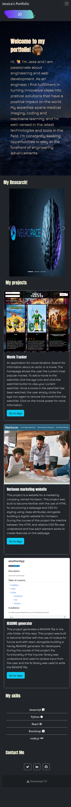

# Bootstrap-portfolio
Portfolio of my work using the Bootstrap CSS Framework

## Description
This project is a website to show my portfolio of work. The project was built to become familiar with bootstrap, as well as to demonstrate my web development journey and university research to future emplyees. During the course of this project the use of bootstrap features including cards, carousels and navigation bars were understood in order to develop an interactive and responsive portfolio design.

## Using Bootstrap to recreate my portfolio site with the following items:

  
- A Navigation bar
    
    - A navigation menu at the top. 

      - Links are included that are applicable to my portfolio.
  
      - Links navigate to the appropriate sections 

- A hero section including an About me section

    - A jumbotron featuring my picture, my name, and my summary.

- My research section

    - A section displaying my uni projects in a carousel. 

    - The description gives a brief overview of the work.

- My project section

    - A section displaying my web development projects in grid. 

    - Bootstrap cards are used for each project.

    - The description gives a brief overview of the work.

- A skills section

    - Lists the skills I expect to learn from the bootcamp.

    
- A footer section/ contact section.

    - All hyperlinks have a hover effect.

    - All buttons display a box shadow upon hover.

- My Bootstrap solution minimizes the use of media queries.

- My new Bootstrap-powered portfolio is deployed to GitHub Pages.

## Jessica's Bootstrap-portfolio Website view

## Jessica's Bootstrap-portfolio mobile view

### Link to deployed application
Access the live application [here](https://jessi994.github.io/Bootstrap-portfolio/)

### Credits

N/A

### License

N/A
